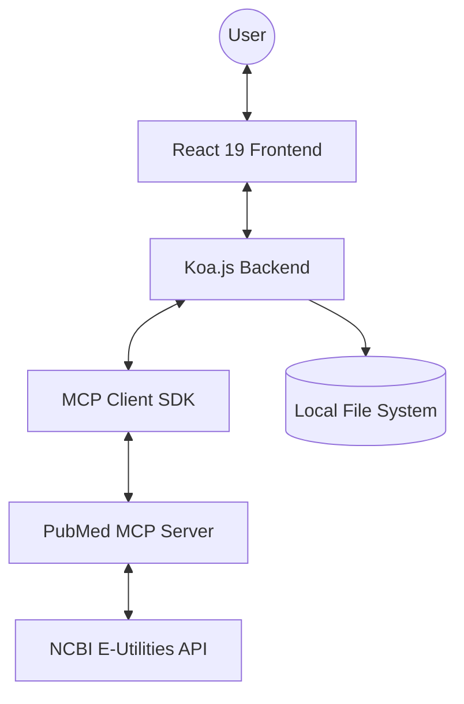

# BioStack Architecture

BioStack is a modern Bio-Research platform designed to streamline PubMed searching and research management. It is built as a full-stack JavaScript application leveraging React 19 and Koa.js, with a unique integration of the Model Context Protocol (MCP).

## System Overview

The platform allows researchers to search the NCBI PubMed database, browse results with a modern UI, utilize MeSH (Medical Subject Headings) for query refinement, and save findings locally for further analysis.

## Frontend Architecture

The frontend is a single-page application (SPA) built with **React 19** and **Vite**.

### Key Technologies
- **React 19**: Utilizes `use` for data fetching and `Suspense` for loading states.
- **Vite**: Modern build tool and development server.
- **Zod**: Client-side validation for search queries.
- **Vanilla CSS**: Custom styling with support for Dark Mode.
- **Native Speech API**: Integrated for text-to-speech capabilities of abstracts.

### Component Structure
- `App.jsx`: Main entry point, manages layout and global health status.
- `PubmedSearch.jsx`: Core component for searching and displaying results.
- `CitationCard.jsx`: Displays individual article metadata and abstracts.
- `MeshSuggester.jsx`: Provides MeSH term suggestions based on the current search.
- `VoiceSettings.jsx`: Controls for the native speech synthesizer.

## Backend Architecture

The backend is a **Koa.js** server that acts as a bridge between the frontend and the PubMed MCP server.

### Key Technologies
- **Koa.js**: Lightweight node.js framework for the API.
- **@modelcontextprotocol/sdk**: Implements the MCP client to interact with external tools.
- **Zod**: Ensures type safety and validation for all incoming API requests.
- **dotenv**: Configuration management via `.env` files.

### MCP Integration
BioStack uses the **Model Context Protocol** to decouple the search logic from the web server. It connects to `@iflow-mcp/pubmed-mcp-server` via a `StdioClientTransport`.

**Tools utilized:**
- `pubmed_search_articles`: For finding PMIDs matching a query.
- `pubmed_fetch_contents`: For retrieving detailed metadata and abstracts for specific PMIDs.

### API Endpoints
- `GET /api/health`: Health status of the server.
- `POST /api/pubmed/search`: Orchestrates the two-step search (find PMIDs -> fetch top results).
- `POST /api/pubmed/fetch`: Fetches detailed data for a specific list of PMIDs (used for pagination).
- `POST /api/pubmed/mesh-lookup`: Analyzes search results to suggest related MeSH terms.
- `POST /api/pubmed/bulk-save`: Exports selected articles to the `research/` directory as text files.

## Data Flow

1. **Search**: The user enters a query. The frontend sends a POST request to `/api/pubmed/search`.
2. **Orchestration**: The Koa server calls the `pubmed_search_articles` MCP tool.
3. **Fetching**: Once PMIDs are returned, the server calls `pubmed_fetch_contents` for the first batch.
4. **Rendering**: The server returns the aggregated data to the client, which renders `CitationCard` components.
5. **Persistence**: When the user clicks "Bulk Save", the client sends the article data to `/api/pubmed/bulk-save`, and the server writes `.txt` files to the local `research/` folder.

## Testing & Quality Assurance

- **Vitest**: Used for both client-side component tests and server-side API tests.
- **Playwright**: Handles end-to-end (E2E) testing, ensuring the search flow works in real browsers.
- **Zod**: Provides a "contract" between the frontend and backend, ensuring data integrity.

## Directory Structure

- `src/client/`: React components, hooks, and assets.
- `src/server/`: Koa application and MCP client configuration.
- `research/`: Target directory for saved article exports.
- `docs/`: Technical specifications and project documentation.
- `prompts/`: Log of architectural decisions and feature development history.
